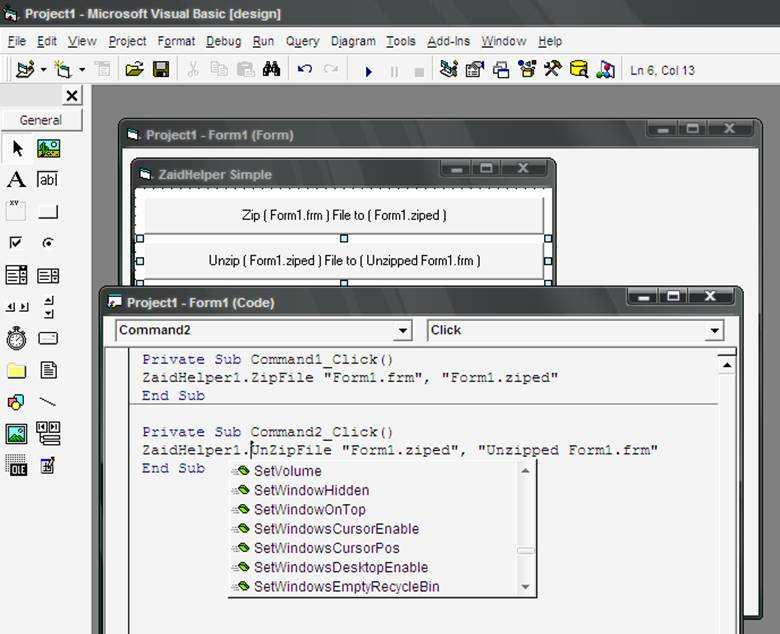



## Zaid Helper

### Description

ZaidHelper ActiveX SDK Released

75 functions in one ActiveX ,Zip&amp;Unzip ,Capture Screen ,Split&amp;Combine Files ,Windows Setting ,Command Buttons ,Progress charts and more...

You can see examples to learn complex functions..

Get it now , and vote for me please..

It supports 75 speedy functions!

CaptureScreenToFile

CDcloseDoor

CDopenDoor

ChangeDriveName

CharFind

CombFile

CommonDailogOpen

CommonDailogSave

CopyFile

CreateFolder

DataBase_Add

DataBase_Close

DataBase_Find

DataBase_Get

DataBase_IsAdded

DataBase_Open

DeleteFile

DrawAnimatedText

DrawDate

DrawDayName

DrawMmonthName

DrawProgressCircle

DrawTime

GetDayName

GetFileSize

GetMmonthName

GetWindowsComputerName

GetWindowsCursorPixelColor

GetWindowsCursorPixelRGB

GetWindowsDriveFreeSize

GetWindowsDriveTotalSize

GetWindowsDriveType

GetWindowsDriveUsedSize

GetWindowsKeyPressed

GetWindowsScreen

GetWindowsScreenAsPicture

GetWindowsSystemPath

GetWindowsTempPath

GetWindowsTimeCount

GetWindowsUserName

GetWindowsVersion

GetWindowsWallpaper

IsConnected

IsFileLocated

MoveFile

OpenPictureFromFile

OpenWebPage

PlayVideoFile

PrintToFile

SavePictureToFile

SetAsCommandButton

SetFileMode

SetVolume

SetWindowHidden

SetWindowOnTop

SetWindowsCursorEnable

SetWindowsCursorPos

SetWindowsDesktopEnable

SetWindowsEmptyRecycleBin

SetWindowsEnableMouseKeyboard

SetWindowShapeCircle

SetWindowShapeElliptic

SetWindowShapeRectAngle

SetWindowShapeRoundRect

SetWindowsScreenSize

SetWindowsStartMenuEnable

ShowRAMStatus

Sleep

SplitFile

TextDeleted

TextReplace

UnZipFile

ZipFile

Today , you can feel the programming more easy!!

Get it now , and vote for me please..

Zaid Markabi
 
### More Info
 
Great Project

             |
---                |---
**Submitted On**   |2008-09-26 10:20:04
**By**             |[Zaid Markabi](https://github.com/Planet-Source-Code/PSCIndex/blob/master/ByAuthor/zaid-markabi.md)
**Level**          |Advanced
**User Rating**    |5.0 (55 globes from 11 users)
**Compatibility**  |VB 5\.0, VB 6\.0
**Category**       |[Complete Applications](https://github.com/Planet-Source-Code/PSCIndex/blob/master/ByCategory/complete-applications__1-27.md)
**World**          |[Visual Basic](https://github.com/Planet-Source-Code/PSCIndex/blob/master/ByWorld/visual-basic.md)
**Archive File**   |[Zaid\_Helpe2128309262008\.zip](https://github.com/Planet-Source-Code/zaid-markabi-zaid-helper__1-71126/archive/master.zip)

